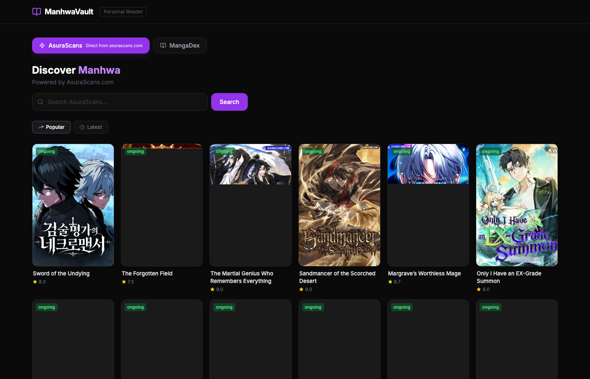
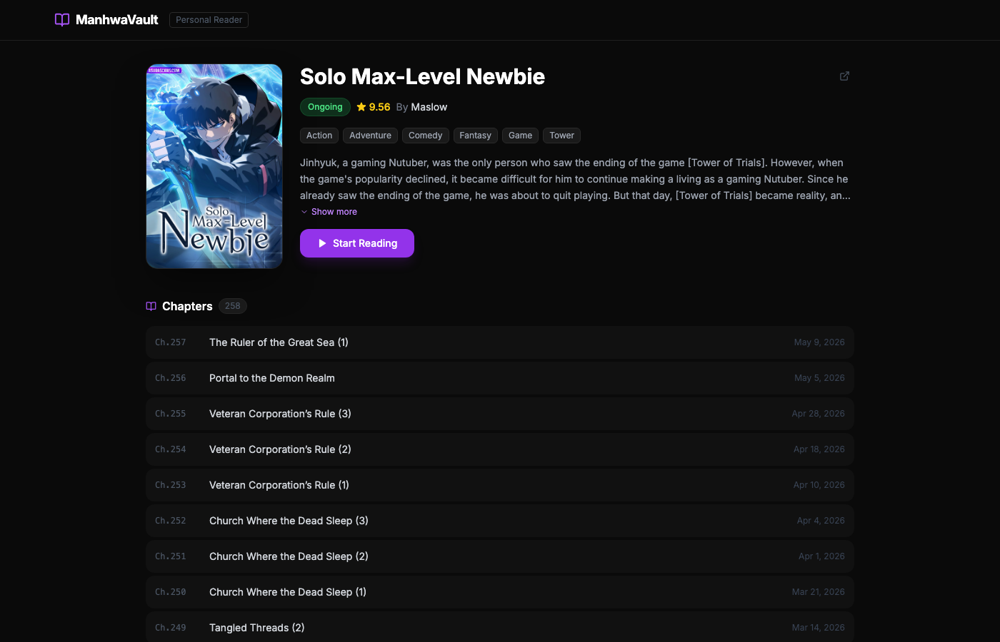
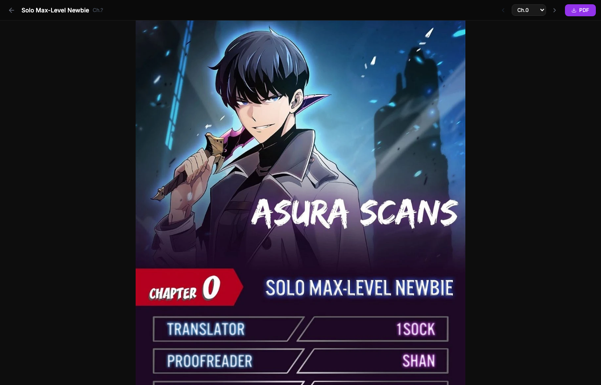
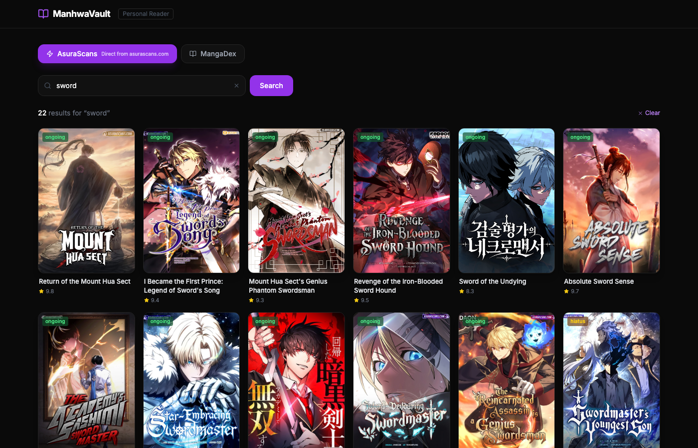

# ManhwaVault 📖

A personal manhwa reader web app with direct AsuraScans integration, MangaDex browsing, and one-click PDF chapter downloads. Hosted on Netlify with serverless functions.

**Live:** https://manhwa-vault.netlify.app

---

## Screenshots

### Home — AsuraScans (default)


### Series Detail


### Reader (webtoon scroll)


### Search


---

## Features

- **Two sources** — AsuraScans (direct API, same data as the official site) and MangaDex (Korean manhwa library)
- **Webtoon reader** — vertical scroll mode, lazy-loaded images
- **Chapter navigation** — prev/next buttons, chapter dropdown selector
- **PDF download** — downloads any chapter as a properly-sized PDF (one page per image)
- **Search** — search by title across either source
- **Browse** — Popular and Latest tabs for both sources
- **Dark UI** — clean, minimal dark theme

---

## Tech Stack

| Layer | Tech |
|-------|------|
| Frontend | React 18 + Vite |
| Styling | Tailwind CSS |
| Routing | React Router v6 |
| PDF | jsPDF (lazy-loaded) |
| Functions | Netlify Serverless Functions |
| Hosting | Netlify |

### Netlify Functions

| Function | Purpose |
|----------|---------|
| `asura.js` | Proxies `api.asurascans.com` (bypasses CORS) |
| `proxy.js` | General HTTPS proxy for images + MangaDex API |
| `mangadex.js` | Dedicated MangaDex API proxy |

---

## Local Development

```bash
# Install dependencies
npm install

# Run locally (requires Netlify CLI for serverless functions)
netlify dev
```

App runs at `http://localhost:8888`. The Netlify functions are served automatically at `/.netlify/functions/*`.

> **Note:** `netlify` CLI must be installed globally (`npm i -g netlify-cli`) or available in your PATH.

---

## Deploy to Netlify

```bash
# Build
npm run build

# Deploy to production
netlify deploy --prod --dir=dist
```

Or connect the GitHub repo to Netlify for automatic deploys on push.

---

## Project Structure

```
manhwa-reader/
├── netlify/
│   └── functions/
│       ├── asura.js        # AsuraScans API proxy
│       ├── proxy.js        # Generic HTTPS proxy (images + API)
│       └── mangadex.js     # MangaDex API proxy
├── src/
│   ├── api/
│   │   ├── asura.js        # AsuraScans API client
│   │   └── mangadex.js     # MangaDex API client
│   ├── components/
│   │   ├── MangaCard.jsx
│   │   ├── Navbar.jsx
│   │   └── Loading.jsx
│   ├── pages/
│   │   ├── Home.jsx        # Browse + search
│   │   ├── MangaDetail.jsx # Series info + chapter list
│   │   └── Reader.jsx      # Chapter reader + PDF download
│   ├── App.jsx
│   └── main.jsx
├── screenshots/
├── netlify.toml
└── package.json
```

---

## Sources

- **AsuraScans** — `https://api.asurascans.com` (unofficial, personal use only)
- **MangaDex** — `https://api.mangadex.org` (public API)

> This project is for personal reading only. Respect each source's terms of service.
